# Crypto Pay

## Índice

[1. Visión y Misión](#1-visión-y-misión)

[2. Contexto y Problema a Resolver](#2-contexto-y-problema-a-resolver)

[3. Análisis del Mercado y Competencia](#3-análisis-del-mercado-y-competencia)

[4. Diferenciadores Clave](#4-diferenciadores-clave)

[5. Estrategia de Monetización](#5-estrategia-de-monetización)

[6. Proyección de Crecimiento](#6-proyección-de-crecimiento)

[7. Descripción del Producto (MVP)](#7-descripción-del-producto-mvp)

[8. Aspectos Técnicos](#8-aspectos-técnicos)

[9. Consideraciones de UX](#9-consideraciones-de-ux)

[10. Roadmap Inicial (MVP)](#10-roadmap-inicial-mvp)

[11. Propuesta de Valor](#11-propuesta-de-valor)

## 1. Visión y Misión

### Visión

Facilitar el uso de las criptomonedas como un método de pago universal, accesible y seguro para todos, eliminando las barreras de complejidad y promoviendo la adopción global de las transacciones en criptoactivos.

### Misión

Nuestra misión es construir una plataforma sencilla e intuitiva que permita a personas y negocios realizar y recibir pagos en criptomonedas sin tener que lidiar con direcciones complejas ni procesos innecesariamente complicados. Buscamos automatizar el proceso de pago, permitiendo a los usuarios interactuar mediante códigos QR y enlaces de pago, lo que democratiza el acceso a las finanzas digitales.

## 2. Contexto y Problema a Resolver

En el contexto actual de las criptomonedas, una de las principales barreras para su adopción masiva como método de pago es la complejidad para realizar transacciones de forma sencilla y accesible. A menudo, el proceso de enviar y recibir pagos en criptomonedas implica tener que compartir direcciones de wallet largas y complejas, lo cual resulta poco práctico para muchos usuarios y puede generar errores o inseguridad.

La plataforma tiene como objetivo facilitar el uso de criptomonedas para pagos P2P, B2C o B2B, resolviendo esta barrera de entrada mediante la automatización de las solicitudes de pago y la eliminación de la necesidad de conocer la dirección de la wallet del destinatario. A continuación, se detallan los principales casos de uso que la aplicación está diseñada para resolver:

### 2.1. Pagos Presenciales con Código QR

Imagina que dos personas se encuentran una al lado de la otra y desean realizar una transacción. En este caso, la persona que recibirá el pago (usuario A) puede generar un código QR con los datos de la transacción (dirección, cantidad, token). La otra persona (usuario B) simplemente escanea el código QR con su billetera compatible y realiza la transacción con un solo clic. Esto permite una experiencia fluida y sin necesidad de intercambiar complejas direcciones de wallet.

### 2.2. Solicitud de Pago mediante Mensajería

En este escenario, el usuario A desea solicitar un pago al usuario B. El usuario A ingresa los datos del pago (cantidad, criptomoneda, etc.) y luego genera un enlace de pago que puede ser enviado directamente a un contacto a través de aplicaciones de mensajería como WhatsApp o Telegram. El usuario B recibe el enlace, abre la aplicación con la información de pago ya cargada, y simplemente confirma el pago. Esto simplifica el proceso de solicitud de pagos sin la necesidad de conocer la dirección de la wallet del pagador.

### 2.3. Pagos Instantáneos entre Usuarios

Este caso plantea un escenario en el que el usuario B quiere realizar un pago al usuario A, similar a cómo funciona Bizum. El usuario B podría seleccionar el contacto al que desea pagar, enviar la cantidad y completar la transacción de manera casi instantánea.

### 2.4. Bote Común para Pagos Grupales

Otro caso de uso es la creación de un bote entre amigos para realizar pagos conjuntos. Por ejemplo, un grupo de amigos que se va de viaje podría crear un fondo común para pagar gastos compartidos como restaurantes o taxis. Este bote común se gestionaría con la condición de que un número mínimo de participantes aprueben cada pago. Al finalizar el viaje, el dinero restante se devolvería a los participantes de manera equitativa. Esto no solo facilita los pagos, sino que también proporciona transparencia y control sobre los gastos grupales.

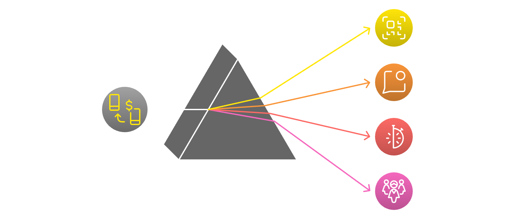

## 3. Análisis del Mercado y Competencia

### 3.1. Análisis del Mercado

El mercado de pagos con criptomonedas ha estado creciendo exponencialmente, con una mayor adopción por parte de comerciantes y usuarios. Cada vez más personas buscan alternativas a los sistemas tradicionales de pago, especialmente en regiones con inestabilidad financiera o restricciones bancarias. La demanda de soluciones que simplifiquen el uso de criptomonedas es alta, pero muchas de las plataformas actuales no son fáciles de usar para usuarios no técnicos.

### 3.2. Análisis de la Competencia

En el mundo de las criptomonedas, hay varias aplicaciones que permiten realizar pagos mediante códigos QR o solicitar pagos de forma similar a servicios tradicionales como WeChat o Bizum. A continuación, se explican algunas de las principales aplicaciones que ofrecen funcionalidades similares, enfocadas en criptomonedas:

1. **Sati.pro**:

   - **Funcionalidad**: Sati.pro es una plataforma que permite aceptar pagos en criptomonedas. Está diseñada para negocios y usuarios que quieran realizar pagos con cryptos.
   - **Solicitudes de Pago**: Los usuarios interactuan con un bot de whatsup.
   - **Redes y Tokens**: Soporta Bitcoin.
   - **Enfoque**: Comercio y servicios que desean recibir pagos en criptomonedas.
   - **Más información**: [Página principal de Sati.pro](https://sati.pro/).

2. **Simplefi.tech**:

   - **Funcionalidad**: Permite recibir pagos para los ecommerce en cyptos.
   - **Solicitudes de Pago**: Se necesita integrar con al API y una wallet y está generará un QR para recibir pagos.
   - **Redes y Tokens**: Soporta DOC, USDT y UXD.
   - **Enfoque**: Comercio y servicios que desean recibir pagos en criptomonedas.
   - **Más información**: [Página principal de Simplefi](https://sati.tech).

3. **Strike**:

   - **Funcionalidad**: Enfocada en la red de Bitcoin y su Lightning Network, Strike permite enviar y recibir pagos rápidamente utilizando códigos QR. Está diseñada para pagos instantáneos y microtransacciones, con un enfoque en la accesibilidad.
   - **Solicitudes de Pago**: Se puede generar un enlace o QR para recibir pagos.
   - **Redes y Tokens**: Principalmente Bitcoin (BTC) a través de la red Lightning.
   - **Enfoque**: Transferencias rápidas, remesas y pagos entre usuarios.
   - **Más información**: [Página principal de Strike](https://strike.me/es/).

4. **Wallet of Satoshi**:

   - **Funcionalidad**: Es una billetera Lightning simple que permite enviar y recibir pagos a través de QR. Su facilidad de uso la hace popular para pequeños comercios y usuarios que desean pagos rápidos.
   - **Solicitudes de Pago**: Permite generar códigos QR para recibir pagos, muy similar a escanear un QR en una transacción convencional.
   - **Redes y Tokens**: Bitcoin a través de la red Lightning.
   - **Enfoque**: Transacciones rápidas de bajo costo y accesibilidad.
   - **Más información**: [Página principal de Wallet of Satoshi](https://www.walletofsatoshi.com/).

5. **BitPay**:

   - **Funcionalidad**: BitPay es conocido por permitir a los comerciantes aceptar pagos en criptomonedas, utilizando códigos QR para las transacciones. Además, permite a los usuarios pagar facturas y comprar bienes y servicios con criptos.
   - **Solicitudes de Pago**: Los comerciantes pueden enviar facturas electrónicas con un enlace de pago que se puede compartir por correo electrónico.
   - **Redes y Tokens**: Bitcoin, Ethereum, Bitcoin Cash, y stablecoins como USDC.
   - **Enfoque**: Principalmente enfocado en comercios y usuarios que desean pagar productos y servicios en criptomonedas.

6. **Coinbase Commerce**:

   - **Funcionalidad**: Permite a los comerciantes aceptar pagos en criptomonedas a través de códigos QR y enlaces de pago. Se puede integrar en sitios web para aceptar pagos.
   - **Solicitudes de Pago**: Genera enlaces de pago que pueden ser compartidos para que el usuario pague desde cualquier billetera compatible.
   - **Redes y Tokens**: Soporta varias criptomonedas como Bitcoin, Ethereum, Litecoin y stablecoins como USDC.
   - **Enfoque**: Comercio electrónico y pagos en línea.

7. **Binance Pay**:

   - **Funcionalidad**: Permite a los usuarios de Binance realizar pagos con criptomonedas de forma gratuita y rápida, generando códigos QR para recibir fondos.
   - **Solicitudes de Pago**: Los usuarios pueden generar códigos QR y enlaces de pago, que se pueden enviar a través de aplicaciones de mensajería.
   - **Redes y Tokens**: Soporta múltiples criptomonedas disponibles en Binance.
   - **Enfoque**: Pagos P2P, remesas y comercio en línea.
   - **Más información**: [Página principal de Binance Pay](https://pay.binance.com/es).

8. **Crypto.com Pay**:

   - **Funcionalidad**: Permite a los usuarios pagar con criptomonedas a través de códigos QR y realizar pagos en comercios físicos y en línea. También facilita las solicitudes de pago a través de su plataforma.
   - **Solicitudes de Pago**: Los usuarios pueden crear enlaces de pago que se pueden compartir con otros para recibir pagos.
   - **Redes y Tokens**: Soporta una amplia gama de criptomonedas.
   - **Enfoque**: Enfocado tanto en usuarios como en comercios que desean integrar pagos con criptomonedas.
   - **Más información**: [Página principal de Crypto.com Pay](https://crypto.com/eea/pay).

9. **Chivo Wallet** (El Salvador):
   - **Funcionalidad**: Aplicación centrada en Bitcoin y su red Lightning, utilizada principalmente en El Salvador. Permite realizar pagos a través de códigos QR de forma rápida y sencilla.
   - **Solicitudes de Pago**: Los usuarios pueden generar códigos QR para recibir pagos.
   - **Redes y Tokens**: Bitcoin y Lightning Network.
   - **Enfoque**: Pagos rápidos y remesas, especialmente en el contexto de El Salvador.
   - **Más información**: [Página principal de Chivo Wallet](https://www.chivowallet.com/).

### 3.3. Adopción de Criptomonedas

La adopción de criptomonedas varía considerablemente según la región. Países como El Salvador han adoptado Bitcoin como moneda de curso legal o paises con problemas de inflación como Argentina, Colombia buscan un refugio en las criptomonedas, mientras que en otras regiones como América del Norte y Europa, las criptomonedas se están integrando lentamente en el comercio electrónico y pagos P2P. Este crecimiento demuestra una oportunidad para nuevas aplicaciones que ofrezcan soluciones simplificadas de pago con cripto.

### 3.4. Análisis FODA (Fortalezas, Oportunidades, Debilidades, Amenazas)

- **Fortalezas**:

  - **Enfoque en RSK**: La aplicación se basa en Rootstock, ofreciendo un enfoque diferente al ser una side chain a bitcoin, creada y usada por bitcoiners, ofreciendo la compatibilidad con Ethereum y contratos inteligentes.
  - **Simplicidad y Accesibilidad**: Generación de códigos QR y enlaces de pago simplificados, lo que facilita la experiencia del usuario.
  - **Restricción de Tokens**: Los pagos solo se realizan con el token solicitado (DOC, USDRif, RBTC), proporcionando claridad y seguridad en las transacciones.

- **Oportunidades**:

  - **Mercado en Crecimiento**: El mercado de las cryptomonedas esta en auge, lo que abre oportunidades para soluciones de pago.
  - **Interacción a través de Mensajería**: La posibilidad de compartir enlaces de pago a través de plataformas de mensajería puede atraer a usuarios que buscan la simplicidad.

- **Debilidades**:

  - **Reconocimiento de Marca**: Como nuevo entrante, se pueden encontrar dificultades para establecer la marca en un mercado competitivo.
  - **Limitación en la Oferta de Criptomonedas**: El enfoque en usar tokens específicos puede limitar la flexibilidad en comparación con competidores que aceptan una mayor variedad de criptomonedas.

- **Amenazas**:
  - **Competencia Intensa**: La competencia de aplicaciones establecidas y conocidas como BitPay y Coinbase Commerce puede dificultar la captación de usuarios.
  - **Regulaciones Cambiantes**: Las regulaciones sobre criptomonedas están en constante evolución y pueden impactar la operativa de la aplicación.
  - **Volatilidad del Mercado**: La volatilidad de las criptomonedas puede afectar la confianza de los usuarios en los pagos con cripto.

## 4. Diferenciadores Clave

1. **Facilidad de Uso**: El enfoque en generar códigos QR y enlaces de pago simplificados ofrece una experiencia más amigable, especialmente para usuarios menos técnicos.

2. **Interacción a través de Mensajería**: La funcionalidad para compartir enlaces de pago fácilmente a través de aplicaciones de mensajería es un diferenciador importante que mejora la usabilidad y accesibilidad.

3. **Transparencia y Control**: Al proporcionar un bote común y funciones de gestión de gastos, se fomenta la transparencia en las transacciones grupales, algo que muchas aplicaciones no ofrecen.

Por lo tanto, a modo de resumen:

- La funcionalidad de compartir enlaces de pago a través de plataformas de mensajería (WhatsApp, Telegram) no está tan desarrollada en algunas de estas aplicaciones, lo cual puede ser un diferenciador clave para el proyecto.
- La restricción de pagar solo con el token solicitado también es una diferencia relevante, ya que la mayoría de estas soluciones permiten pagos con diferentes criptomonedas, aunque no coincidan con la solicitada.

## 5. Análisis Stablecoins

Revisanson la información que se puede visualizar en Defillama (stables), se puede ver que las stablecoins que dominan son USDT y USDC. A Continuación se explican las redes más usadas y guiadas por las fees más bajas según Gas Fees Now.

### Visión General
El mercado de stablecoins está dominado en su mayoría por **USDT** y **USDC**, con USDT liderando con una participación del 69.63% del mercado total, equivalente a $120.44 mil millones, y **USDC** en segundo lugar con el 19.95% ($34.414 mil millones). Ambos stablecoins se distribuyen de manera distinta en cada blockchain, variando según los costos de transacción y el tipo de aplicaciones que soportan.

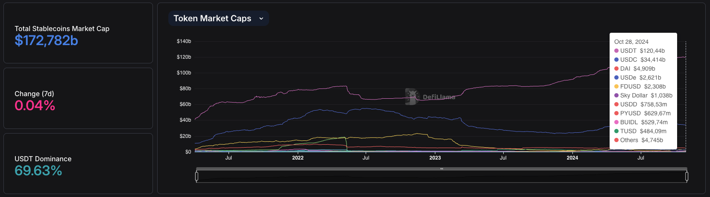
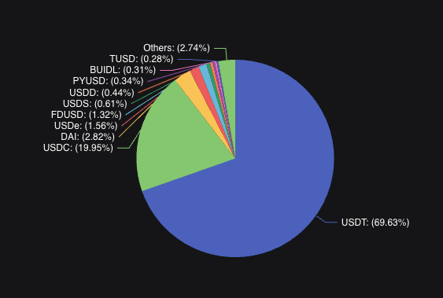

### Análisis por Blockchain

1. **Ethereum**:
   - **Distribución**: En Ethereum, el volumen de stablecoins es de $84.245 mil millones. **USDT** tiene una cuota de 56.17%, seguido de **USDC** con 26.95%.
   - **Costos de Transacción**: La tarifa media en Ethereum es de aproximadamente **$2.47 USD** para stablecoins, según [Gas Fees Now](https://gasfeesnow.com), lo que lo hace costoso para transacciones pequeñas.
  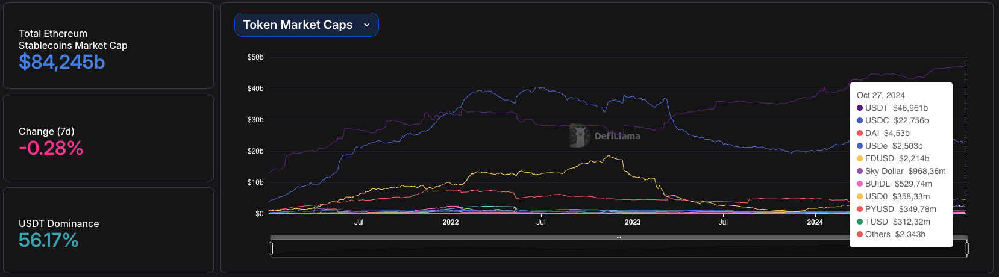
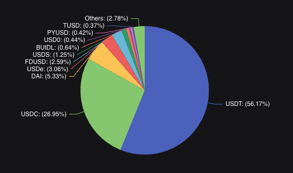

2. **Tron**:
   - **Distribución**: Tron es casi exclusivamente dominado por **USDT**, que representa el 98.26% del volumen total en esta red, equivalente a $59.492 mil millones.
   - **Costos de Transacción**: El costo de transacción en Tron se sitúa entre **$2.2 y $4.47 USD**, lo cual sigue siendo relativamente económico para transacciones de alto volumen.
  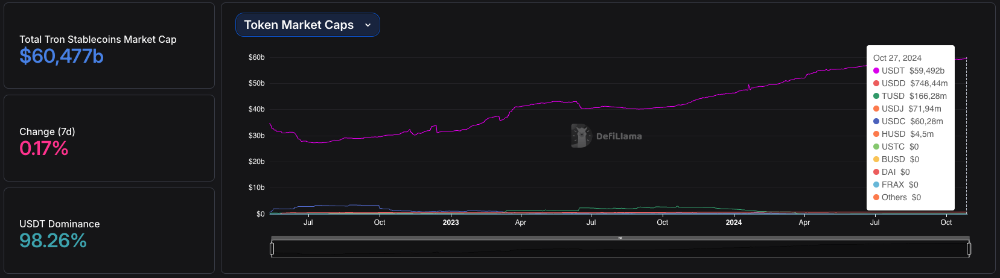
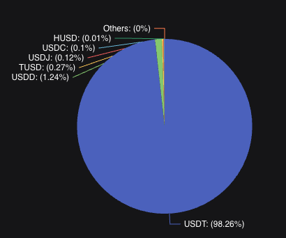

1. **Binance Smart Chain (BSC)**:
   - **Distribución**: En BSC, USDT lidera con el 77.98% del mercado de stablecoins, mientras que USDC ocupa el 9.86%.
   - **Costos de Transacción**: Los costos de transacción en BSC son bajos, aproximadamente **$0.09 USD** en promedio.
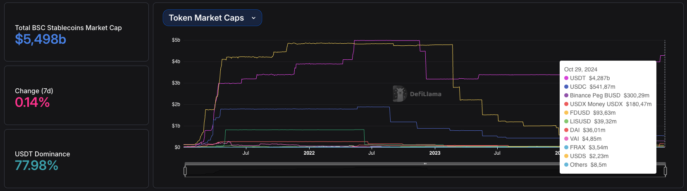
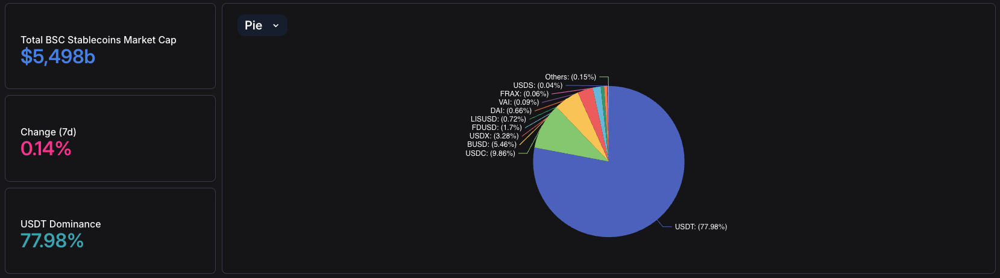

1. **Polygon**:
   - **Distribución**: En Polygon, **USDC** domina con el 54.53% del volumen, mientras que USDT representa el 38.96%.
   - **Costos de Transacción**: Las tarifas en Polygon son extremadamente bajas, con un promedio de **$0.001 USD**.
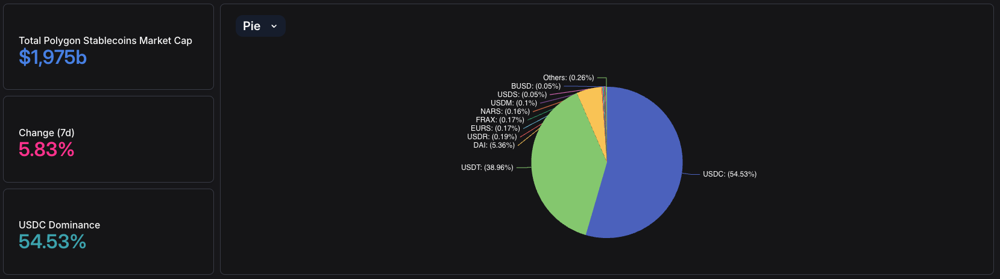

1. **Solana**:
   - **Distribución y Preferencia**: Solana es utilizada tanto para USDT como para USDC, especialmente para aplicaciones que requieren rapidez y bajo costo.
   - **Costos de Transacción**: Las tarifas en Solana varían entre **$0.14 y $0.54 USD**.

2. **TON**:
   - **Distribución**: En TON, el mercado de stablecoins es exclusivamente de **USDT**, con una capitalización de mercado de **$867.75 millones**, lo que representa una dominancia del 100%.
   - **Costos de Transacción**: Las tarifas en TON  es aproximadamente **$0.073 USD**, es conocido por tener costos de transacción competitivos y atractivos para USDT en aplicaciones móviles y de mensajería como Telegram.
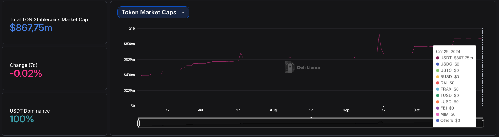

Esta distribución resalta cómo cada blockchain se especializa en un tipo de stablecoin en función de su perfil de tarifas y ecosistema, con **Tron** y **TON** sobresaliendo para USDT, mientras que **Polygon** y **Ethereum** son preferidos para USDC en aplicaciones DeFi.

## 5. Estrategia de Monetización

La estrategia de monetización se basará en los siguientes pilares:

- **Comisiones por transacción**: Se cobrará una pequeña tarifa por cada transacción completada en la plataforma, manteniéndola competitiva con otros servicios del mercado.
- **Suscripciones Premium**: Los negocios que quieran funcionalidades avanzadas, como reportes detallados de transacciones o gestión avanzada, podrán suscribirse a un plan premium.
- **Integraciones Comerciales**: Comisiones por integración de API con tiendas en línea y otros servicios comerciales, facilitando el acceso a la funcionalidad de pagos con criptomonedas.

## 6. Proyección de Crecimiento

Se estima que el mercado de criptomonedas continuará creciendo en los próximos años. Nuestra plataforma buscará alcanzar un crecimiento de usuarios progresivo, empezando con un público de early adopters en el ecosistema Rootstock (RSK) y expandiendo gradualmente hacia otros mercados.

Proyectamos:

- **Fase 1 (6 meses)**: 5,000 usuarios activos y 50 negocios utilizando la plataforma.
- **Fase 2 (12 meses)**: 20,000 usuarios activos, con integración en comercios locales y regionales.
- **Fase 3 (24 meses)**: Expansión internacional, alcanzando 100,000 usuarios activos y 500 negocios asociados.

## 7. Descripción del Producto (MVP)

1. **Generar un QR para Pagos (P2P)**

   - **Funcionalidad Principal**: Los usuarios podrán generar un código QR que contiene la información del pago (dirección del receptor, cantidad a transferir, etc.). Cualquier persona con la aplicación podrá escanear este código QR y realizar el pago.
   - **Flujo del Usuario**: El usuario ingresa la cantidad a recibir y selecciona la criptomoneda (DOC, USDRif, RBTC). La aplicación genera un código QR con los datos necesarios para el pago. El código QR se presenta al pagador, quien lo escanea con su billetera compatible y realiza el pago.
   - **Restricción de Token**: Solo se podrá pagar con el token solicitado. Por ejemplo, si el usuario solicita DOC, el pagador no podrá usar otro token.
   - **Beneficios**: Transacciones rápidas y sin fricciones; ideal para negocios o individuos que necesiten recibir pagos en eventos físicos.

   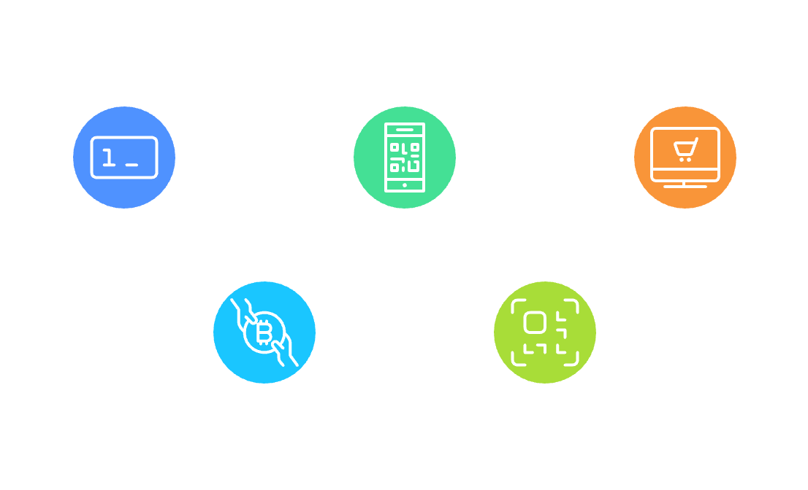

2. **Solicitar Pago mediante Enlace**

   - **Funcionalidad Principal**: Los usuarios podrán generar un enlace único para solicitar pagos. Este enlace se podrá compartir a través de email, WhatsApp o Telegram. Al hacer clic en el enlace, el pagador será redirigido a la aplicación para completar el pago.
   - **Flujo del Usuario**: El usuario selecciona la cantidad a recibir y la criptomoneda (DOC, USDRif o RBTC). La aplicación genera un enlace único que incluye todos los detalles del pago. El usuario comparte el enlace mediante email o aplicaciones de mensajería. El destinatario recibe el enlace, accede a la web y realiza el pago.
   - **Restricción de Token**: El pagador solo podrá completar el pago utilizando el token solicitado por el receptor.
   - **Integraciones Propuestas**: WhatsApp API para facilitar la compartición de enlaces de pago.
   - **Beneficios**: Facilita solicitudes de pago a distancia, eliminando la necesidad de que ambas partes estén presentes.

   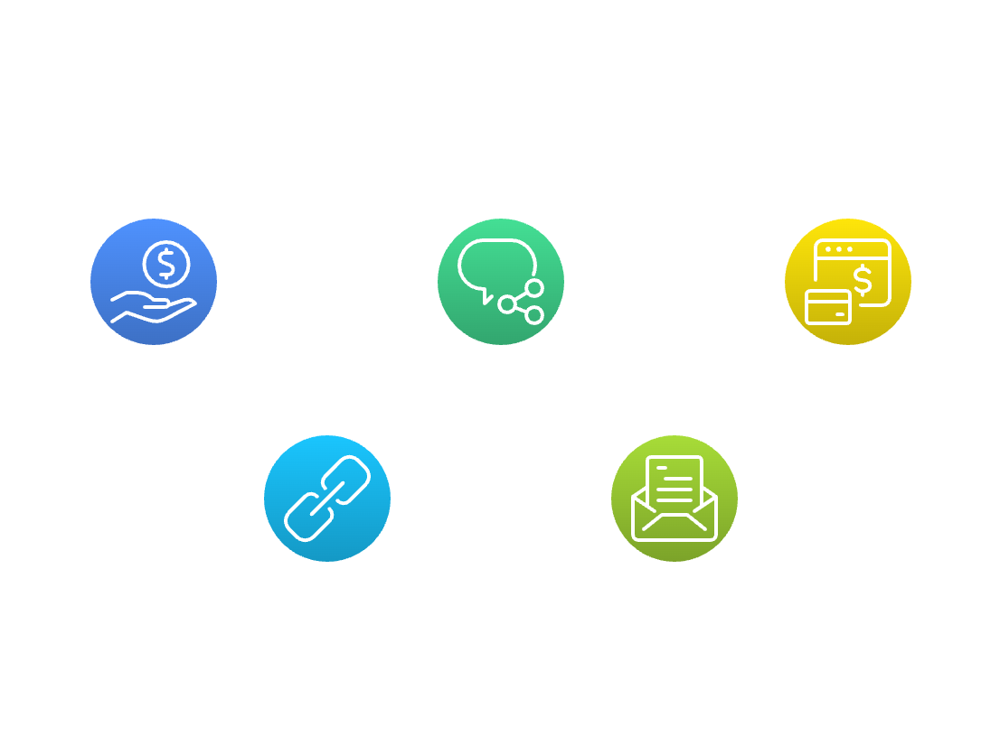

## 8. Aspectos Técnicos

La arquitectura de la aplicación estará diseñada para facilitar la interacción entre los usuarios y la blockchain, permitiendo un flujo de trabajo eficiente y seguro. A continuación se describe la arquitectura propuesta para el MVP, que se centrará en las siguientes dos funcionalidades:

1. **Pagos Presenciales con Código QR**:

   - **Descripción**: El usuario A genera un código QR que contiene los datos de la transacción, incluyendo la dirección de la wallet, la cantidad y el token. El usuario B escanea el código QR con su billetera compatible y realiza el pago.
   - **Componentes**:
     - **Frontend**: Una aplicación web desarrollada con tecnologías modernas (como React) que permite a los usuarios interactuar de manera intuitiva. Utilizará bibliotecas de JavaScript, como **qrcode.js** o **QRCode.react**, para generar códigos QR en tiempo real.
     - **Interacción con Blockchain**: La aplicación frontend se conectará directamente a la red RSK utilizando bibliotecas como **ethers.js** o **web3.js**. Esto permitirá a los usuarios interactuar con los smart contracts y realizar las transacciones directamente desde la aplicación.
     - **Wallets**: Los usuarios deberán usar billeteras compatibles, como MetaMask o Rabby, también se ofrecerá un login con una cuenta con Google, para firmar y enviar transacciones.

2. **Solicitud de Pago mediante Mensajería**:
   - **Descripción**: El usuario A ingresa los detalles del pago y genera un enlace que se enviará a usuario B a través de aplicaciones de mensajería. Usuario B puede abrir el enlace y confirmar el pago.
   - **Componentes**:
     - **Frontend**: La misma aplicación web permitirá a usuario A ingresar los detalles del pago (cantidad, criptomoneda, etc.) y generar un enlace de pago. Este enlace incluirá toda la información necesaria para la transacción.
     - **Interfaz de Mensajería**: El usuario A podrá copiar el enlace y compartirlo directamente a través de aplicaciones de mensajería como WhatsApp.
     - **Interacción con Blockchain**: Al igual que con la funcionalidad de códigos QR, la aplicación utilizará bibliotecas de JavaScript para comunicarse directamente con la red RSK y procesar los pagos.

### 2. Escalabilidad y Mantenimiento

- **Escalabilidad**:

  - **Arquitectura Modular**: La aplicación se diseñará de manera modular, lo que permitirá agregar nuevas funcionalidades en el futuro sin necesidad de rehacer el sistema existente. Esto facilitará la implementación de características adicionales, como pagos entre negocios o integración con más criptomonedas.
  - **Uso de Smart Contracts**: La lógica de negocio será gestionada a través de smart contracts en la red RSK. Esto asegura que las transacciones sean seguras y transparentes, y permite a la aplicación manejar un volumen creciente de usuarios y transacciones.

- **Mantenimiento**:
  - **Actualizaciones de Seguridad**: Aunque todo se maneje desde el frontend, se establecerán procedimientos para asegurar que las bibliotecas y dependencias estén actualizadas y seguras.
  - **Monitoreo y Análisis**: Implementar herramientas de monitoreo del rendimiento del frontend y la interacción con la blockchain. Esto permitirá seguir el uso de la aplicación y detectar problemas de forma proactiva.
  - **Feedback de Usuarios**: Como el MVP se lanzará para evaluar la interacción de los usuarios, se recopilarán comentarios y sugerencias para realizar mejoras continuas en la experiencia del usuario.

### Conclusión

La arquitectura técnica propuesta para el MVP está diseñada para facilitar la interacción fluida entre los usuarios y la blockchain, asegurando un proceso de pago sencillo y accesible. Al centrarse en estas dos funcionalidades clave, la aplicación podrá validarse en el mercado y ajustarse a las necesidades de los usuarios, mientras se establece una base sólida para futuras expansiones y mejoras.

## 9. Consideraciones de UX

- **Simplicidad**: Diseñar una interfaz intuitiva, donde la generación de un QR o enlace de pago sea accesible con pocos clics.
- **Accesibilidad**: Incluir opciones claras para copiar o compartir enlaces a diferentes plataformas de mensajería desde la misma aplicación.
- **Compatibilidad móvil**: La aplicación debe ser completamente responsive y compatible con dispositivos móviles, considerando que muchos usuarios accederán desde teléfonos.

## 10. Roadmap Inicial (MVP)

- **Investigación y Arquitectura**: Definir las tecnologías principales: RSK, APIs de mensajería. Diseñar los flujos de usuarios, comunicación entre los distintos módulos y las interfaces(UX/UI) principales para la generación de QR y enlaces de pago.
- **Limitación de Tokens**: El sistema deberá permitir pagos exclusivamente con los tokens solicitados, que inicialmente serán: DOC, USDRif y RBTC. Para cada solicitud de pago, solo se permitirá completar la transacción con el token solicitado (DOC, USDRif o RBTC).
- **Desarrollo de Funcionalidades**: Desarrollo Smart Contracts necesarios para la gestión de pagos. Generación de códigos QR para pagos. Implementación del sistema de solicitudes de pago mediante enlaces. Integración con APIs de WhatsApp. Validación de Tokens.
- **Pruebas y Validación**: Realizar pruebas internas y en testnets de RSK para asegurar la estabilidad y seguridad del sistema. Validación de la experiencia de usuario en diferentes dispositivos y navegadores. Testeo de Tokens.
- **Lanzamiento del MVP**: Enfocarse en una fase de lanzamiento para usuarios iniciales (early adopters) con las funcionalidades clave (QR y enlaces) y con la limitación de pagos solo en DOC, USDRif y RBTC. Recoger feedback para mejorar la interfaz y la funcionalidad.

## 11. Propuesta de Valor

- **Accesibilidad**: Proporcionar una manera sencilla y sin complicaciones para que personas o negocios reciban pagos en criptomonedas utilizando la red de Rootstock.
- **Eficiencia**: Reducir la fricción en los pagos P2P mediante el uso de tecnologías de QR y enlaces para realizar transferencias rápidas y seguras.
- **Escalabilidad**: Potencial para expandir la plataforma con características adicionales, como la división de pagos y herramientas de facturación para negocios.
